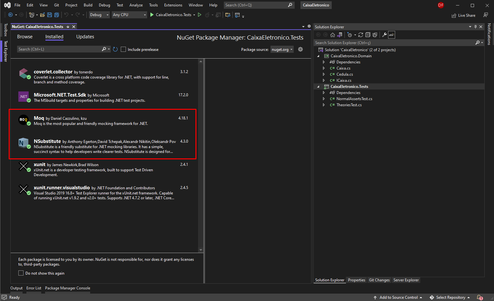
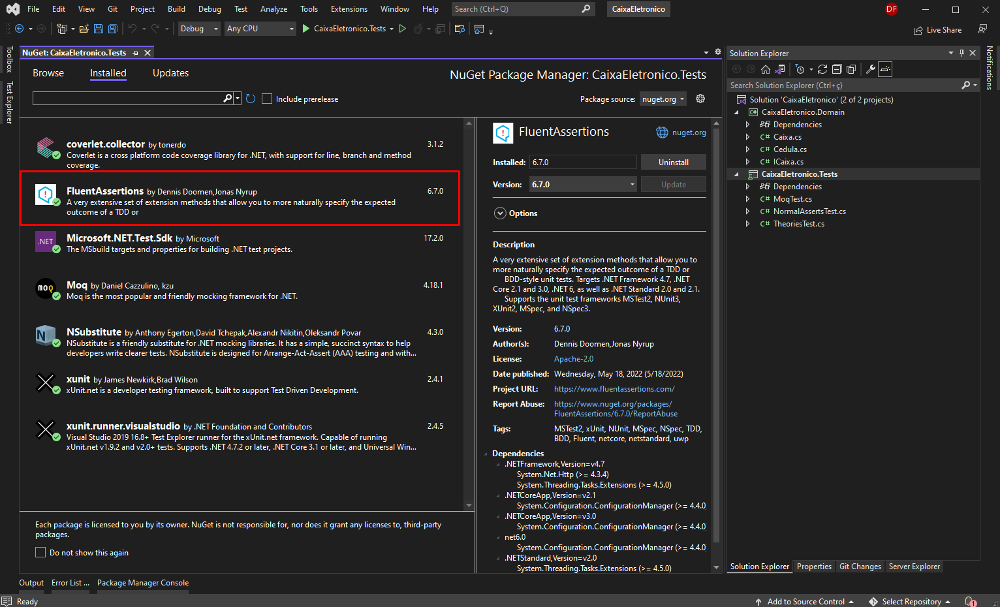
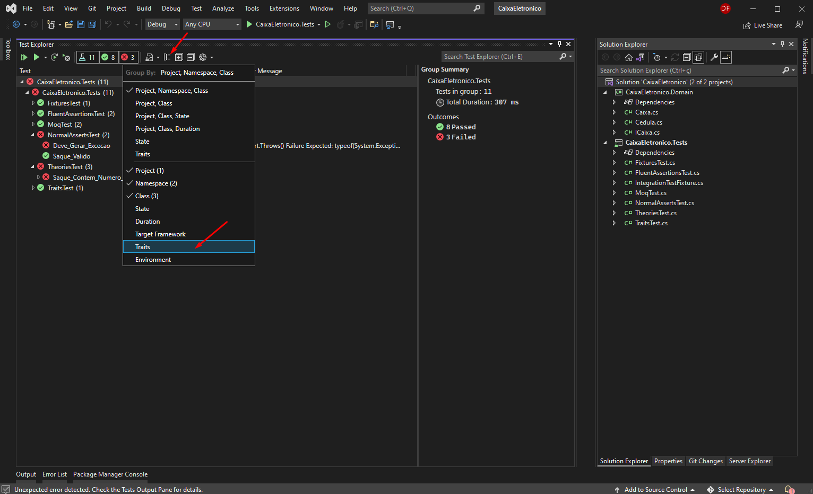
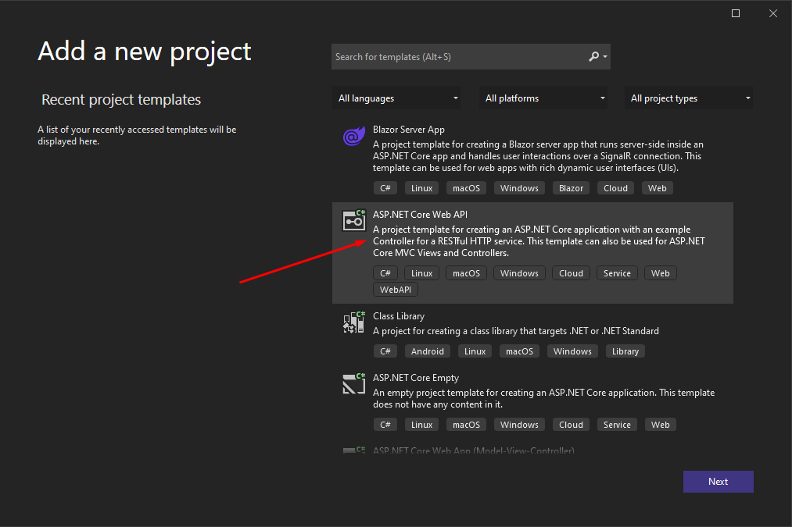
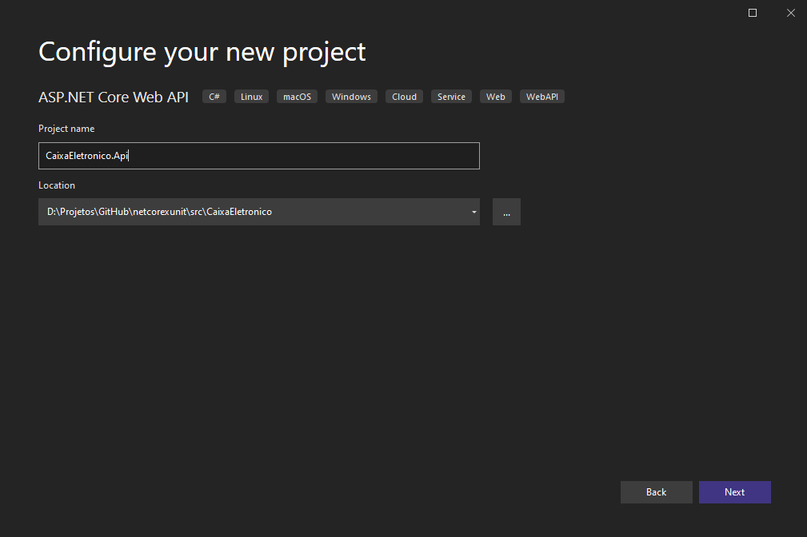
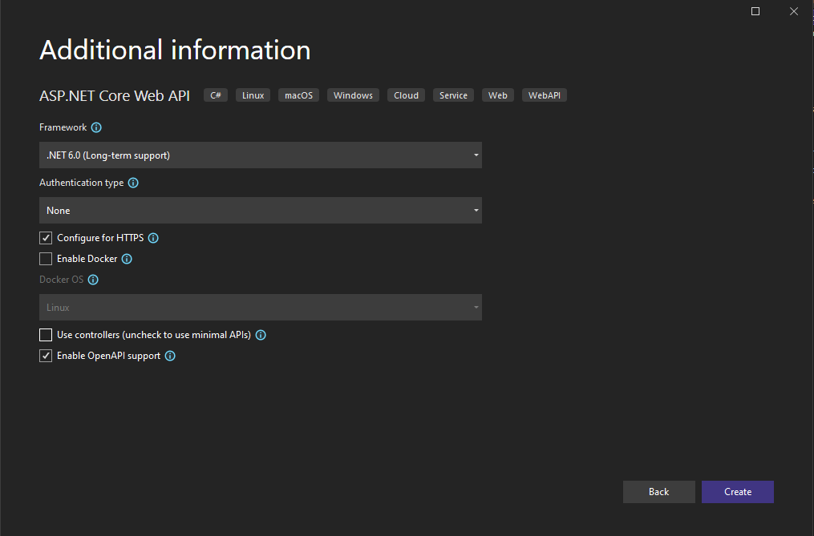
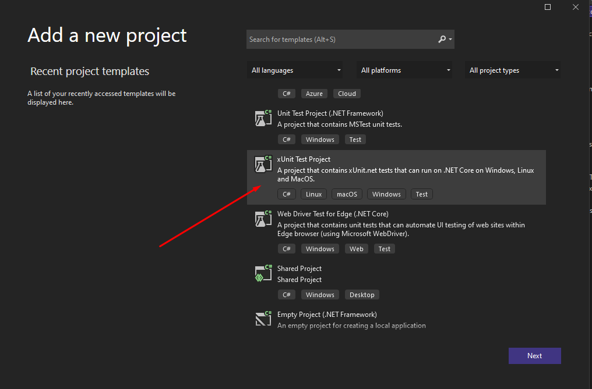
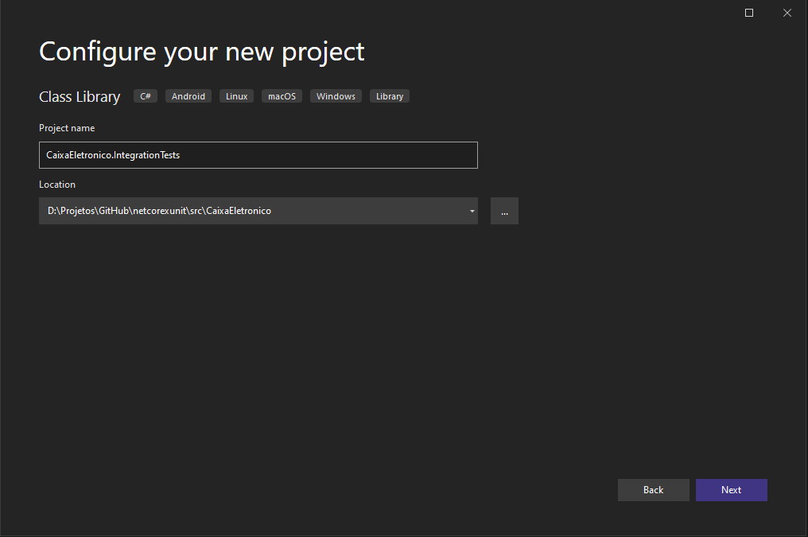
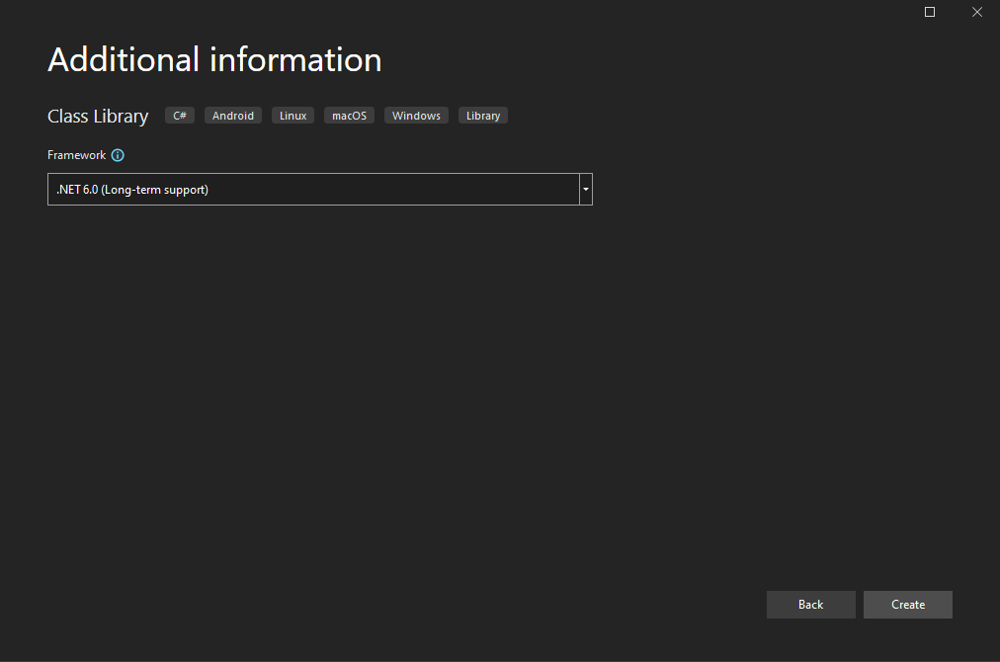
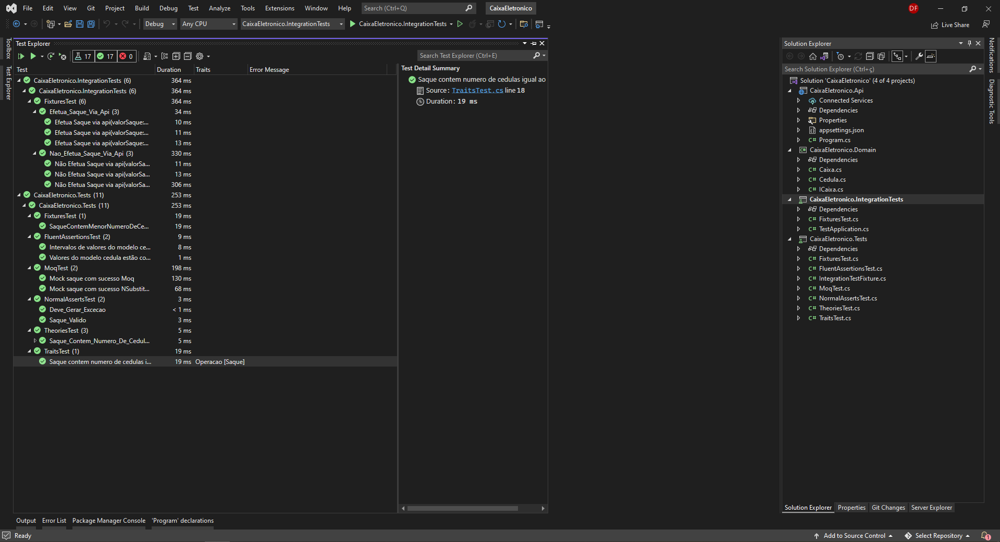

# Testes Unitários com .Net 6 com xUnit

Neste artigo vamos aprender sobre Teste Unitário e como ele pode ser implementado no .Net 6.

## O que é Teste Unitário?

Um teste de unidade é o menor pedaço de código que pode ser logicamente isolado em um sistema, geralmente pensamos no menor pedaço de código logicamente isolado como nossas funções. Com este pequeno pedaço de código, podemos executar testes automatizados que garantem que nosso código esteja sempre gerando o resultado correto.

## Por que devo testar meu código?

* Economiza tempo: em alguns casos, elimina a necessidade de testes manuais
* Automação: a capacidade de testar novamente o código alterado em tempo real
* Código Eficiente: certifique-se de que todos os cenários em potencial sejam cobertos e para tornar o Teste de Unidade possível, precisamos estruturar nosso código de maneira que possamos realmente testá-lo. O que significa que precisamos seguir certos padrões como SOLID.
* Documentação: Ajude-nos a entender a lógica por trás de nossos métodos
* Qualidade: Melhore a qualidade de nossa base de código, ajude-nos a evitar o máximo possível de dívidas tecnológicas
* Confiável: Quando os testes estão passando e sendo executados automaticamente podemos ter lançamentos mais suaves e mais frequentes

## Criando o projeto de Testes

Como projeto de exemplo, iremos criar uma aplicação simples simulando um caixa eletrônico e a disponibilização de saque de acordo com o valor solicitado e as cédulas disponíveis para saque.

Inicie o Visual Studio e clique em Create a new project


Escolha a template "Class Library"


Neste passo, iremos criar um projeto da camada de domínio, que são as regras de negócio


Escolha ".Net 6.0 (Long-term support)" que é a última versão disponível do .net até a data de criação deste tutorial


Pronto, agora temos uma estrutura básica para inciarmos o projeto


Agora vamos criar uma classe chamada "Cedula.cs" que consiste nas cédulas disponíveis


Segue o código para classe recém criada:

```csharp
namespace CaixaEletronico.Domain
{
    public static class Cedula
    {
        public static int Cem => 100;
        public static int Cinquenta => 50;
        public static int Vinte => 20;
        public static int Dez => 10;
    }
}
```

Agora vamos criar uma classe do tipo interface chamada "ICaixa.cs" que consiste nas ações que podemos realizar


Segue o código para classe recém criada:

```csharp
namespace CaixaEletronico.Domain
{
    public interface ICaixa
    {
        ICollection<int> Saque(int valor);

        bool ValidaCedulasDisponiveis(int valor);
    }
}
```

Agora vamos criar uma classe chamada "Caixa.cs" que é implementação da interface recém criada


Segue o código para classe recém criada:

```csharp
namespace CaixaEletronico.Domain
{
    public class Caixa : ICaixa
    {
        public ICollection<int> Saque(int valor)
        {
            var cedulasSacadas = new List<int>();
            var valorRestanteASerSacado = valor;

            while (valorRestanteASerSacado >= Cedula.Cem)
            {
                cedulasSacadas.Add(Cedula.Cem);

                valorRestanteASerSacado -= Cedula.Cem;
            }

            while (valorRestanteASerSacado >= Cedula.Cinquenta)
            {
                cedulasSacadas.Add(Cedula.Cinquenta);

                valorRestanteASerSacado -= Cedula.Cinquenta;
            }

            while (valorRestanteASerSacado >= Cedula.Vinte)
            {
                cedulasSacadas.Add(Cedula.Vinte);

                valorRestanteASerSacado -= Cedula.Vinte;
            }

            while (valorRestanteASerSacado >= Cedula.Dez)
            {
                cedulasSacadas.Add(Cedula.Dez);

                valorRestanteASerSacado -= Cedula.Dez;
            }

            if (cedulasSacadas.Count == 0)
                throw new System.Exception("Não há cedulas disponíveis para o valor solicitado.");

            return cedulasSacadas;
        }

        public bool ValidaCedulasDisponiveis(int valor)
        {
            return valor % 10 == 0;
        }
    }
}
```

Bem, nós acabamos de criar nosso projeto com as regras de negócio de um caixa eletrônico fictício com as funções de saque e validar cédulas disponíveis.

Agora iremos criar os testes para validar essas funções.

Em Solution Explorer, vamos adicionar um projeto do tipo "xUnit Test Project"


Crie o projeto com o nome "CaixaEletronico.Tests"


Escolha ".Net 6.0 (Long-term support)" que é a última versão disponível do .net até a data de criação deste tutorial


Pronto, agora temos uma estrutura básica para inciarmos o projeto de testes


Em Solution Explorer, para o projeto de testes, referencie o projeto da camada de domínio


## Teste de unidade

Podemos afirmar que um teste de unidade é basicamente o teste da menor parte testável de um programa. Ou seja, neste caso devemos então testar as funções ou métodos de nossas classes no projeto, pois esta é a menor parte de unidade testável. Com xUnit temos diversas funcionalidade para nos auxiliar a implementar o teste de unidade. Irei exemplificar alguns deles a seguir.

## Facts

Com xUnit a criação de um teste simples pode ser feita com com um método adicionando sobre ele o atributo Fact. Para assegurar que o teste deve obedecer algum resultado esperado utilizamos a class Assert. Na classe Assert temos uma grande lista de possibilidades, como verificar se resultado é falso, verdadeiro, igual, maior, menor, nulo e até se deve esperar alguma exceção.

Agora vamos criar uma classe de teste chamada "NormalAssertsTest.cs" que consiste nas testes assertivos


Segue o código para classe recém criada:

```csharp
using CaixaEletronico.Domain;
using System;
using Xunit;

namespace CaixaEletronico.Tests
{
    public class NormalAssertsTest
    {
        private readonly Caixa caixa = new Caixa();

        [Fact]
        public void Saque_Valido()
        {
            var valorDoSaque = 510;
            var saqueEhValido = caixa.ValidaCedulasDisponiveis(valorDoSaque);

            Assert.True(saqueEhValido);
        }

        [Fact]
        public void Deve_Gerar_Excecao()
        {
            var valorDoSaque = 5;

            Assert.Throws<Exception>(() => caixa.Saque(valorDoSaque));
        }
    }
}
```

## Theories

Existem situações onde o valor de entrada pode ter valor mutável. E neste caso para evitar escrever vários Assert ou vários métodos de teste para testar a mesma função alterando somente o valor de entrada temos o atributo Theory. Para informar o valor de entrada utilizado no teste utilizamos o atributo InlineData e passamos os valores necessários.

Agora vamos criar uma classe de teste chamada "TheoriesTest.cs" que consiste nas testes de valor mutável


Segue o código para classe recém criada:

```csharp
using CaixaEletronico.Domain;
using Xunit;

namespace CaixaEletronico.Tests
{
    public class TheoriesTest
    {
        private readonly Caixa caixa = new Caixa();

        [Theory(DisplayName = "Saque contém número de cedulas solicitado correto")]
        [InlineData(3, 80)]
        [InlineData(3, 300)]
        [InlineData(5, 500)]
        public void Saque_Contem_Numero_De_Cedulas_Correto(int quantidadeDeCedulas, int valorDoSaque)
        {
            var resultadoCedulas = caixa.Saque(valorDoSaque);

            Assert.Equal(quantidadeDeCedulas, resultadoCedulas.Count);
        }
    }
}
```

Agora vamos executar os testes a fim de verificar se tudo está ok.


## Moq e NSubstitute

Quando falamos em realizar um mock de teste, queremos dizer que vamos simular execução da ação, imitar o comportamento de algum objeto real. Para esta necessidade contamos com algumas bibliotecas e dentre elas irei apresentar exemplos de uso com NSubstitute e Moq. Estes também podem ser instalados via nuget.

* [Moq](https://github.com/moq/moq)
* [NSubstitute](https://nsubstitute.github.io/)

Instale os dois pacotes



Agora vamos criar uma classe de teste chamada "MoqTest.cs", com o seguinte código:

```csharp
using CaixaEletronico.Domain;
using Moq;
using NSubstitute;
using System;
using Xunit;

namespace CaixaEletronico.Tests
{
    public class MoqTest
    {
        [Fact(DisplayName = "Mock saque com sucesso NSubstitute")]
        public void Saque_Com_Sucesso_NSUb()
        {
            // Cria objeto mock
            var caixa = Substitute.For<ICaixa>();
            var valorDoSaque = 50;

            // Efetua simulação de saque e assegura que retorno é int de array
            caixa.Saque(valorDoSaque).Returns(Array.Empty<int>());

            // Confirma que método foi executado uma unica vez
            caixa.Received(1);
        }

        [Fact(DisplayName = "Mock saque com sucesso Moq")]
        public void Saque_Com_Sucesso_Moq()
        {
            // Cria objeto mock
            var caixa = new Mock<ICaixa>();
            var valorDoSaque = 50;

            // Efetua simulação de saque
            caixa.Object.Saque(valorDoSaque);
            
            // Confirma que método foi executado uma unica vez
            caixa.Verify(r => r.Saque(valorDoSaque), Times.Once);
        }
    }
}
```

## FluentAssertions

Esta é uma alternativa para a utilização da classe Assert. Caso você prefira uma escrita mais fluente, com estilo de programação funcional, este é o pacote ideal. O pacote pode FluentAssertions ser instalado via nuget.

* [FluentAssertions](https://fluentassertions.com/)



Nesta implementação realizamos o teste na classe Cedula para ter certeza que nenhum valor correspondente ao atributo ao qual ele foi delegado mudou durante o desenvolvimento ou está incorreto.

Vamos criar uma classe de teste chamada "FluentAssertionsTest.cs", com o seguinte código:

```csharp
using CaixaEletronico.Domain;
using FluentAssertions;
using Xunit;

namespace CaixaEletronico.Tests
{
    public class FluentAssertionsTest
    {
        [Fact(DisplayName = "Valores do modelo cedula estão corretos")]
        public void ValoresModeloCedulaEstaoCorretos()
        {
            Cedula.Cem.Should().Be(100);
            Cedula.Cinquenta.Should().BeOfType(typeof(int)).And.Be(50);
            Cedula.Vinte.Should().BeOfType(typeof(int)).And.Be(20);
            Cedula.Dez.Should().BeOfType(typeof(int)).And.Be(10);
        }


        [Fact(DisplayName = "Intervalos de valores do modelo cedula estão corretos")]
        public void IntervalosValoresModeloCedulaEstaoCorretos()
        {
            Cedula.Cinquenta.Should().BeLessThan(Cedula.Cem);
            Cedula.Dez.Should().BeLessThan(Cedula.Vinte);
        }
    }
}
```

## Fixtures

Quando criamos um objeto no construtor da classe de teste, que é equivalente ao TestInitialize do MSTest ou SetUp do NUnit, em cada teste executado é feita a instancia do objeto que esta no construtor. Com Fixtures temos a possibilidade de ter um contexto compartilhado. Logo, caso haja a necessidade de evitar instanciar o mesmo objeto varias vezes e disponibilizar para toda a suite de teste, o uso de Fixture é uma ótima solução. Para criar uma Fixture e para testar por exemplo, sua camada de modelo, com as injeções de independência e disponibilização do contexto, devemos criar uma classe que servirá de classe Fixture.

```csharp
using CaixaEletronico.Domain;
using Microsoft.Extensions.DependencyInjection;

namespace CaixaEletronico.Tests
{
    public class IntegrationTestFixture
    {
        public IntegrationTestFixture()
        {
            var serviceCollection = new ServiceCollection();
            serviceCollection.AddTransient<ICaixa, Caixa>();

            ServiceProvider = serviceCollection.BuildServiceProvider();
        }

        public ServiceProvider ServiceProvider { get; private set; }
    }
}
```

Para utilizar esta classe na sua classe de teste basta herdar IClassFixture<IntegrationTestFixture> e no construtor receber a Fixture criada como injeção de dependência. Segue exemplo abaixo:

```csharp
using CaixaEletronico.Domain;
using Microsoft.Extensions.DependencyInjection;
using Xunit;

namespace CaixaEletronico.Tests
{
    public class FixturesTest : IClassFixture<IntegrationTestFixture>
    {
        private ICaixa _caixa;

        public FixturesTest(IntegrationTestFixture fixture)
        {
            _caixa = fixture.ServiceProvider.GetRequiredService<ICaixa>();
        }

        [Fact]
        public void SaqueContemMenorNumeroDeCedulas()
        {
            var quantidadeDeCedulas = 3;
            var valorDoSaque = 80;

            var resultadoCedulas = _caixa.Saque(valorDoSaque);

            Assert.Equal(quantidadeDeCedulas, resultadoCedulas.Count);
        }
    }
}
```

## Traits

Organize os seus testes utilizando as Traits do xUnit. Na aba Test Explorer do visual studio, você pode organizar a visualização dos testes por classes, projeto, namespace e… Traits. Ao utilizar Traits é possível por exemplo criar grupos por domino, como testes de cliente, conta, investimentos…

Ao utilizar o atributo Trait devemos informar dois parâmetros string, nome e valor do Trait. Como no exemplo [Trait("Operação","Saque")] .

Vamos criar uma classe de teste chamada "TraitsTest.cs", com o seguinte código:

```csharp
using CaixaEletronico.Domain;
using Microsoft.Extensions.DependencyInjection;
using Xunit;

namespace CaixaEletronico.Tests
{
    public class TraitsTest : IClassFixture<IntegrationTestFixture>
    {
        private ICaixa _caixa;

        public TraitsTest(IntegrationTestFixture fixture)
        {
            _caixa = fixture.ServiceProvider.GetRequiredService<ICaixa>();
        }

        [Fact(DisplayName = "Saque contem numero de cedulas igual ao predito")]
        [Trait("Operacao", "Saque")]
        public void Saque_Contem_Numero_De_Cedulas_Igual_Ao_Predito()
        {
            //Arrange
            int quantidadeDeCedulas = 3;
            int valorDoSaque = 80;

            //Act
            var resultadoCedulas = _caixa.Saque(valorDoSaque);

            //Assert
            Assert.Equal(quantidadeDeCedulas, resultadoCedulas.Count);
        }
    }
}
```

Para visualizar os testes por Traits, na aba Test Explorer, botão Group By, escolha a opção Traits.



## Teste de integração

No teste de integração cobre a necessidade de testar a comunicação entre as camadas do sistema. Enquanto no teste de unidade testamos somente as partes de unidade isoladas no sistema, no teste de integração testamos o fluxo completo como por exemplo, uma api que recebe um requisição e vai até a base de dados realizar alguma operação. Neste tipo de teste devemos garantir o sucesso deste fluxo no sistema.

Então, iremos criar um projeto do tipo Api



Escolha o nome "CaixaEletronico.Api"



Desmarque a opção "Use controllers" porque iremos criar uma Api com o mínimo de código possível



Após o projeto ser criado, faça uma referência para o projeto "CaixaEletronico.Domain" e modifique o código da classe "Program.cs" para:

```csharp
using CaixaEletronico.Domain;
using Microsoft.AspNetCore.Mvc;

var builder = WebApplication.CreateBuilder(args);

builder.Services.AddSingleton<ICaixa, Caixa>();
builder.Services.AddEndpointsApiExplorer();
builder.Services.AddSwaggerGen();

var app = builder.Build();

app.MapGet("/saque/{valor}", ([FromServices] ICaixa caixa, int valor) =>
{
    if (!caixa.ValidaCedulasDisponiveis(valor))
        return Results.BadRequest("Valor não válido para saque. Notas disponíveis: 100, 50, 20 e 10");

    return Results.Ok($"Receba seu saque: { string.Join(',', caixa.Saque(valor)) }");
});

app.UseHttpsRedirection();
app.UseSwagger();
app.UseSwaggerUI();
app.Run();

public partial class Program { }
```

Como você pode perceber, é um código bem enxuto com uma única requisição GET, com a responsabilidade de efetuar saques, legal não é?

Agora vamos criar o projeto de teste de integração.

Em Solution Explorer, vamos adicionar um projeto do tipo "xUnit Test Project"



Crie o projeto com o nome "CaixaEletronico.IntegrationTests"



Escolha ".Net 6.0 (Long-term support)" que é a última versão disponível do .net até a data de criação deste tutorial



Pronto, agora temos uma estrutura básica para inciarmos o projeto de testes.

Novamente em Solution Explorer, para o projeto de teste de integração, referencie o projeto Api e também adicione os dois pacotes Nuget:

* [Microsoft.AspNetCore.App](https://www.nuget.org/packages/Microsoft.AspNetCore.App/)
* [Microsoft.AspNetCore.Mvc.Testing](https://www.nuget.org/packages/Microsoft.AspNetCore.Mvc.Testing/)

## Fixtures

A criação de Fixture para teste de integração em api é muito similar ao utilizado anteriormente para teste de unidade. A fixture criada neste exemplo lhe dará poder de interagir com camada de Api e testar todo fluxo dali em diante.

Você deve criar uma classe similar a classe Startup, mas, preferencialmente removendo todas dependências e serviços desnecessários para o teste de integração, como por exemplo swagger. Caso você utilize swagger em seu projeto, no startup do teste de integração seria desnecessário a ativação deste serviço. O projeto Api deve ser referenciado no seu projeto de teste de integração, aqui vamos chamá-la de TestApplication.cs.

```csharp
using CaixaEletronico.Domain;
using Microsoft.AspNetCore.Mvc.Testing;
using Microsoft.Extensions.DependencyInjection;
using Microsoft.Extensions.Hosting;

namespace CaixaEletronico.IntegrationTests
{
    public class TestApplication : WebApplicationFactory<Program>
    {
        protected override IHost CreateHost(IHostBuilder builder)
        {
            builder.ConfigureServices(services =>
            {
                services.AddScoped<ICaixa, Caixa>();
            });

            return base.CreateHost(builder);
        }
    }
}
```

E por fim podemos implementar os testes e utilizar a configuração de Fixture criada acima.

```csharp
using System.Net;
using System.Net.Http.Json;
using System.Threading.Tasks;
using Xunit;

namespace CaixaEletronico.IntegrationTests
{
    public class FixturesTest
    {
        [Theory(DisplayName = "Efetua Saque via api")]
        [InlineData(80)]
        [InlineData(300)]
        [InlineData(500)]
        public async Task Efetua_Saque_Via_Api(int valorSaque)
        {
            await using var application = new TestApplication();
            using var client = application.CreateClient();

            var request = await client.PostAsJsonAsync($"/saque/{valorSaque}", new { });
            var response = await request.Content.ReadAsStringAsync();

            Assert.True(request.IsSuccessStatusCode);
            Assert.Contains("Receba seu saque", response);
        }

        [Theory(DisplayName = "Não Efetua Saque via api")]
        [InlineData(5)]
        [InlineData(15)]
        [InlineData(38)]
        public async Task Nao_Efetua_Saque_Via_Api(int valorSaque)
        {
            await using var application = new TestApplication();
            using var client = application.CreateClient();

            var request = await client.PostAsJsonAsync($"/saque/{valorSaque}", new { });
            var response = await request.Content.ReadAsStringAsync();

            Assert.False(request.IsSuccessStatusCode);
            Assert.Contains("Valor não válido para saque", response);
            Assert.Equal(HttpStatusCode.BadRequest, request.StatusCode);
        }
    }
}
```

Agora você pode ir Test Explorer e executar todos os testes, se você seguiu todos os passos corretamente todos os testes irão passar!



Gosto muito de criar testes com xUnit e creio que se você ainda não cria testes também irá gostar. Ele tem uma maneira que julgo mais enxuta e pratica de implementar os testes. Espero que as dicas acima lhes ajudem a implementar os testes em seu sistema.


## Links e materiais interessantes 

* [Melhores práticas de teste de unidade com .NET Core e .NET Standard](https://docs.microsoft.com/pt-br/dotnet/core/testing/unit-testing-best-practices)
* [C# de teste de unidade no .NET Core usando dotnet test e xUnit](https://docs.microsoft.com/pt-br/dotnet/core/testing/unit-testing-with-dotnet-test)
* [xunit.net](https://xunit.net/)
* [Exemplo de teste da xunit.net](https://xunit.net/docs/getting-started/netcore/cmdline)
