# Testes Unitários com .Net 6 com xUnit

Neste artigo vamos aprender sobre Teste Unitário e como ele pode ser implementado no .Net 6.

## O que é Teste Unitário?

Um teste de unidade é o menor pedaço de código que pode ser logicamente isolado em um sistema, geralmente pensamos no menor pedaço de código logicamente isolado como nossas funções. Com este pequeno pedaço de código, podemos executar testes automatizados que garantem que nosso código esteja sempre gerando o resultado correto.

## Por que devo testar meu código?

* Economiza tempo: em alguns casos, elimina a necessidade de testes manuais
* Automação: a capacidade de testar novamente o código alterado em tempo real
* Código Eficiente: certifique-se de que todos os cenários em potencial sejam cobertos e para tornar o Teste de Unidade possível, precisamos estruturar nosso código de maneira que possamos realmente testá-lo. O que significa que precisamos seguir certos padrões como SOLID.
* Documentação: Ajude-nos a entender a lógica por trás de nossos métodos
* Qualidade: Melhore a qualidade de nossa base de código, ajude-nos a evitar o máximo possível de dívidas tecnológicas
* Confiável: Quando os testes estão passando e sendo executados automaticamente podemos ter lançamentos mais suaves e mais frequentes

## Criando o projeto de Testes

Como projeto de exemplo, iremos criar uma aplicação simples simulando um caixa eletrônico e a disponibilização de saque de acordo com o valor solicitado e as cédulas disponíveis para saque.

Inicie o Visual Studio e clique em Create a new project


Escolha a template "Class Library"

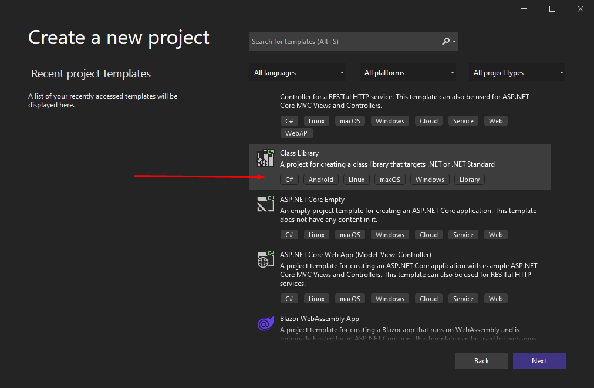

Neste passo, iremos criar um projeto da camada de domínio, que são as regras de negócio

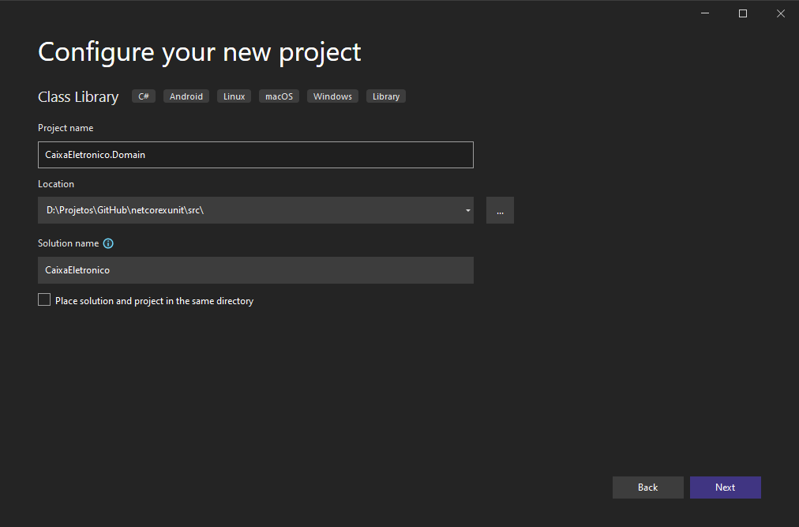

Escolha ".Net 6.0 (Long-term support)" que é a última versão disponível do .net até a data de criação deste tutorial

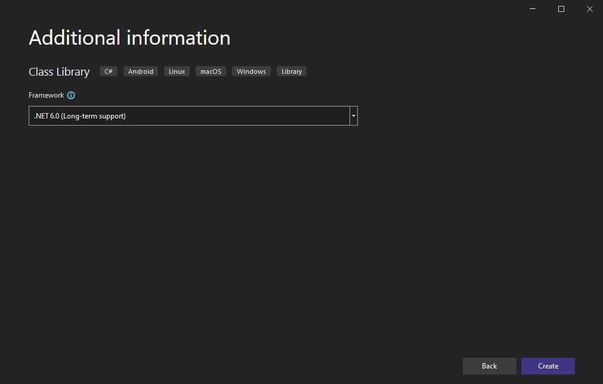

Pronto, agora temos uma estrutura básica para inciarmos o projeto

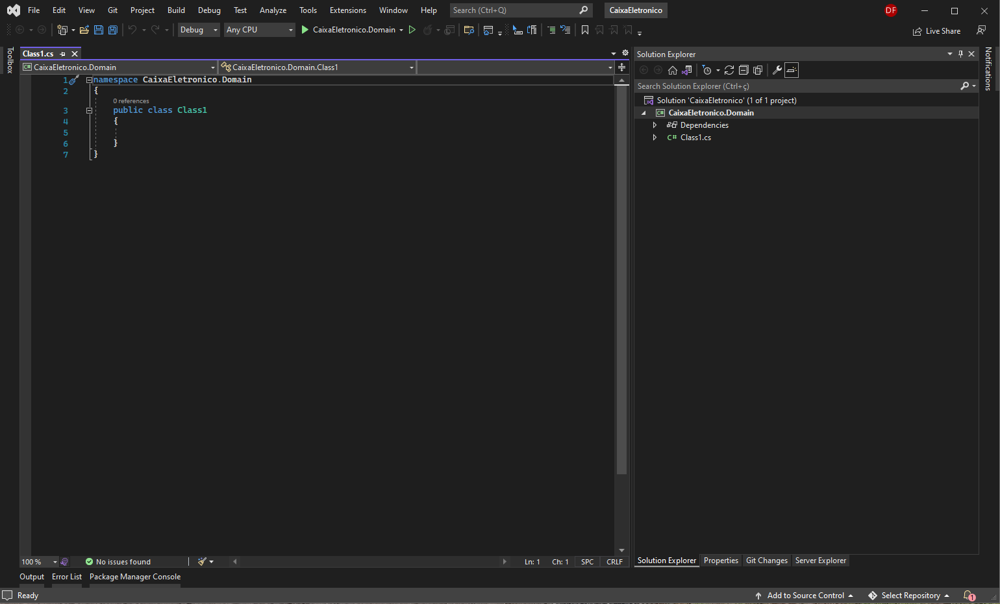

Agora vamos criar uma classe chamada "Cedula.cs" que consiste nas cédulas disponíveis

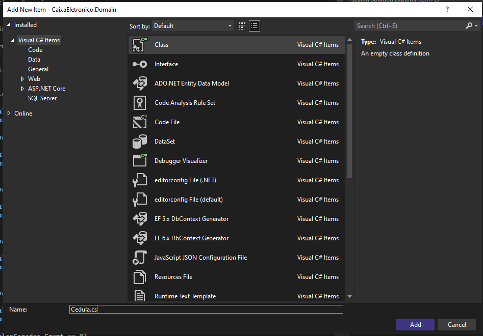

Segue o código para classe recém criada:

```csharp
namespace CaixaEletronico.Domain
{
    public static class Cedula
    {
        public static int Duzentos => 200;
        public static int Cem => 100;
        public static int Cinquenta => 50;
        public static int Vinte => 20;
        public static int Dez => 10;
        public static int Cinco => 5;
        public static int Dois => 2;
    }
}
```

Agora vamos criar uma classe do tipo interface chamada "ICaixa.cs" que consiste nas ações que podemos realizar

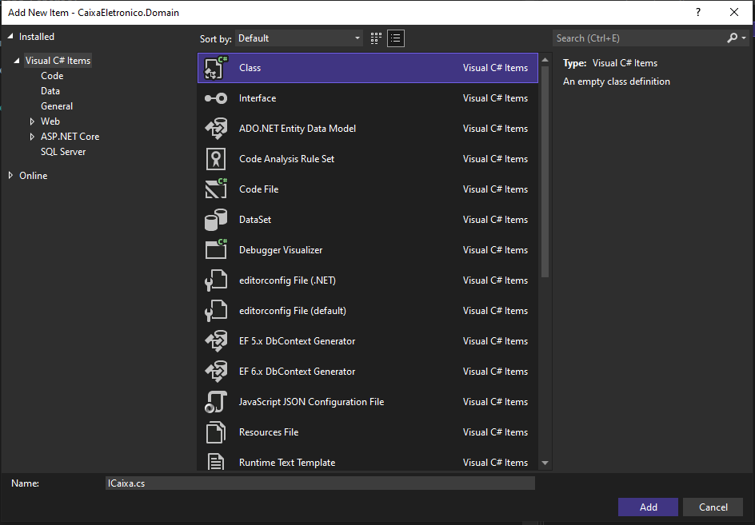

Segue o código para classe recém criada:

```csharp
namespace CaixaEletronico.Domain
{
    public interface ICaixa
    {
        ICollection<int> Saque(int valor);

        bool ValidaCedulasDisponiveis(int valor);
    }
}
```

Agora vamos criar uma classe chamada "Caixa.cs" que é implementação da interface recém criada

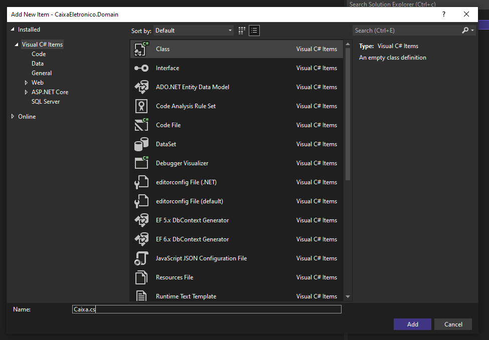

Segue o código para classe recém criada:

```csharp
namespace CaixaEletronico.Domain
{
    public class Caixa : ICaixa
    {
        public ICollection<int> Saque(int valor)
        {
            var cedulasSacadas = new List<int>();
            var valorRestanteASerSacado = valor;

            while (valorRestanteASerSacado >= Cedula.Duzentos)
            {
                cedulasSacadas.Add(Cedula.Duzentos);

                valorRestanteASerSacado -= Cedula.Duzentos;
            }

            while (valorRestanteASerSacado >= Cedula.Cem)
            {
                cedulasSacadas.Add(Cedula.Cem);

                valorRestanteASerSacado -= Cedula.Cem;
            }

            while (valorRestanteASerSacado >= Cedula.Cinquenta)
            {
                cedulasSacadas.Add(Cedula.Cinquenta);

                valorRestanteASerSacado -= Cedula.Cinquenta;
            }

            while (valorRestanteASerSacado >= Cedula.Vinte)
            {
                cedulasSacadas.Add(Cedula.Vinte);

                valorRestanteASerSacado -= Cedula.Vinte;
            }

            while (valorRestanteASerSacado >= Cedula.Dez)
            {
                cedulasSacadas.Add(Cedula.Dez);

                valorRestanteASerSacado -= Cedula.Dez;
            }

            while (valorRestanteASerSacado >= Cedula.Cinco)
            {
                cedulasSacadas.Add(Cedula.Cinco);

                valorRestanteASerSacado -= Cedula.Cinco;
            }

            while (valorRestanteASerSacado >= Cedula.Dois)
            {
                cedulasSacadas.Add(Cedula.Dois);

                valorRestanteASerSacado -= Cedula.Dois;
            }

            if (cedulasSacadas.Count == 0)
                throw new System.Exception("Não há cedulas disponíveis para o valor solicitado.");

            return cedulasSacadas;
        }

        public bool ValidaCedulasDisponiveis(int valor)
        {
            return valor % 10 == 0;
        }
    }
}
```

Bem, nós acabamos de criar nosso projeto com as regras de negócio de um caixa eletrônico fictício com as funções de saque e validar cédulas disponíveis. Então vamos falar sobre testes.

## Teste de unidade

Podemos afirmar que um teste de unidade é basicamente o teste da menor parte testável de um programa. Ou seja, neste caso devemos então testar as funções ou métodos de nossas classes no projeto, pois esta é a menor parte de unidade testável. Com xUnit temos diversas funcionalidade para nos auxiliar a implementar o teste de unidade. Irei exemplificar alguns deles a seguir.

## Facts

Com xUnit a criação de um teste simples pode ser feita com com um método adicionando sobre ele o atributo Fact. Para assegurar que o teste deve obedecer algum resultado esperado utilizamos a class Assert. Na classe Assert temos uma grande lista de possibilidades, como verificar se resultado é falso, verdadeiro, igual, maior, menor, nulo e até se deve esperar alguma exceção.

## Theories

Existem situações onde o valor de entrada pode ter valor mutável. E neste caso para evitar escrever vários Assert ou vários métodos de teste para testar a mesma função alterando somente o valor de entrada temos o atributo Theory. Para informar o valor de entrada utilizado no teste utilizamos o atributo InlineData e passamos os valores necessários.

Agora iremos criar os testes para validar essas funções.

Em Solution Explorer, vamos adicionar um projeto do tipo "xUnit Test Project"

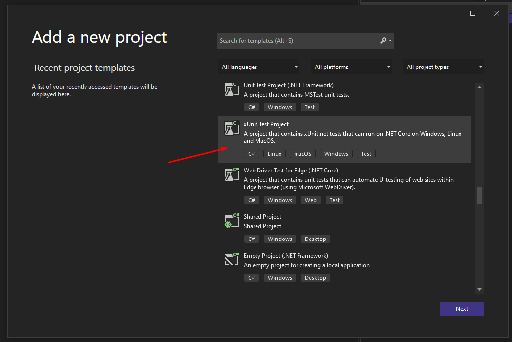

Crie o projeto com o nome "CaixaEletronico.Tests"

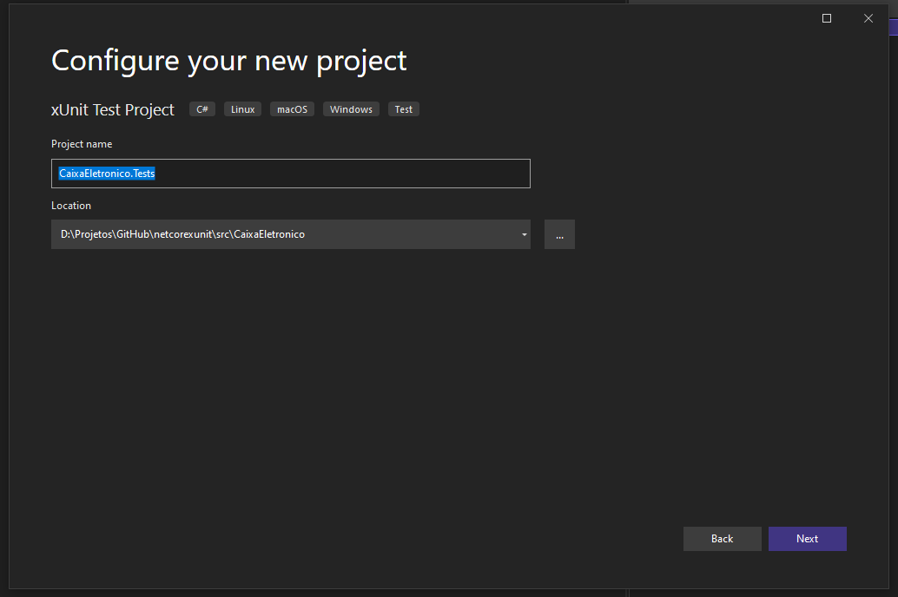

Escolha ".Net 6.0 (Long-term support)" que é a última versão disponível do .net até a data de criação deste tutorial

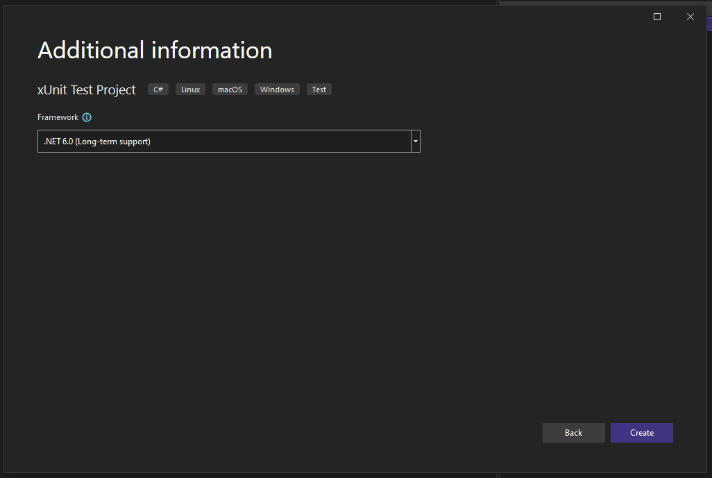

Pronto, agora temos uma estrutura básica para inciarmos o projeto de testes

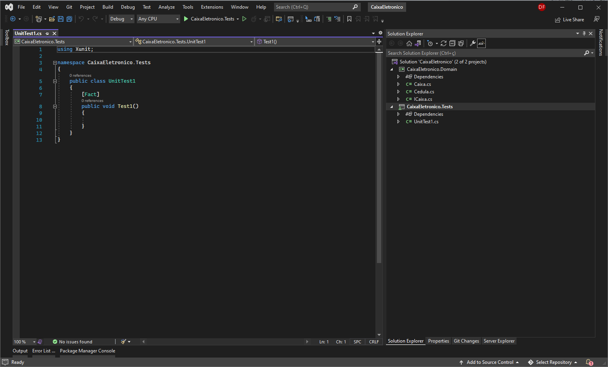

Em Solution Explorer, para o projeto de testes, referencie o projeto da camada de domínio

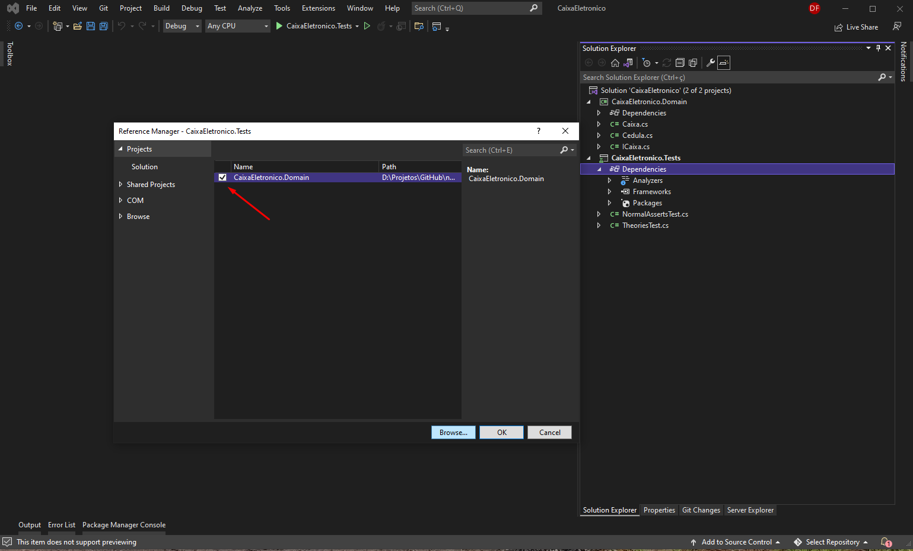

Agora vamos criar uma classe de teste chamada "NormalAssertsTest.cs" que consiste nas testes assertivos

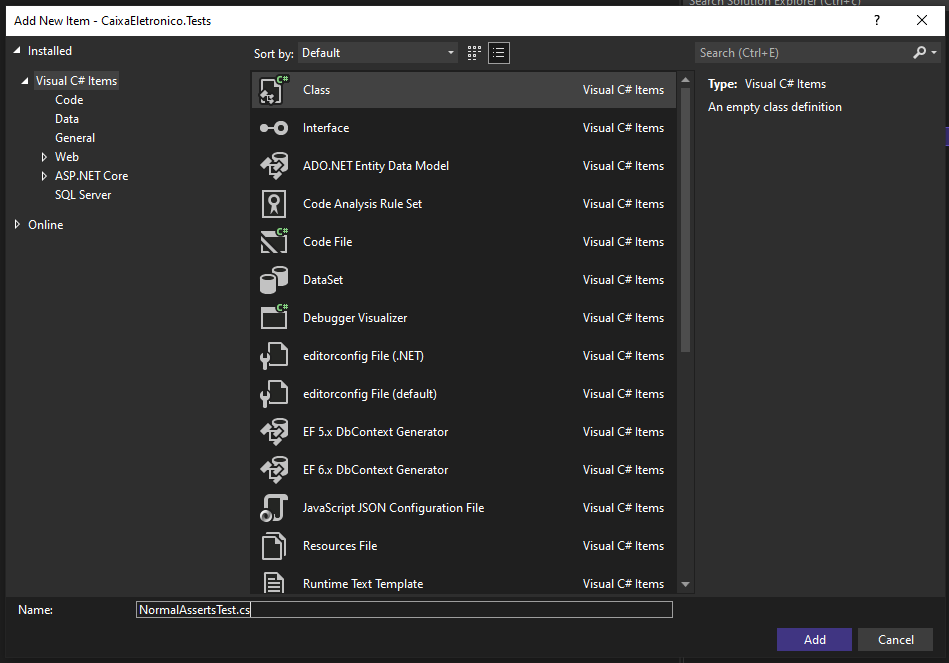

Segue o código para classe recém criada:

```csharp
using CaixaEletronico.Domain;
using System;
using Xunit;

namespace CaixaEletronico.Tests
{
    public class NormalAssertsTest
    {
        private readonly Caixa caixa = new Caixa();

        [Fact]
        public void Saque_Valido()
        {
            var valorDoSaque = 510;
            var saqueEhValido = caixa.ValidaCedulasDisponiveis(valorDoSaque);

            Assert.True(saqueEhValido);
        }

        [Fact]
        public void Deve_Gerar_Excecao()
        {
            var valorDoSaque = 5;

            Assert.Throws<Exception>(() => caixa.Saque(valorDoSaque));
        }
    }
}
```

Agora vamos criar uma classe de teste chamada "TheoriesTest.cs" que consiste nas testes de valor mutável

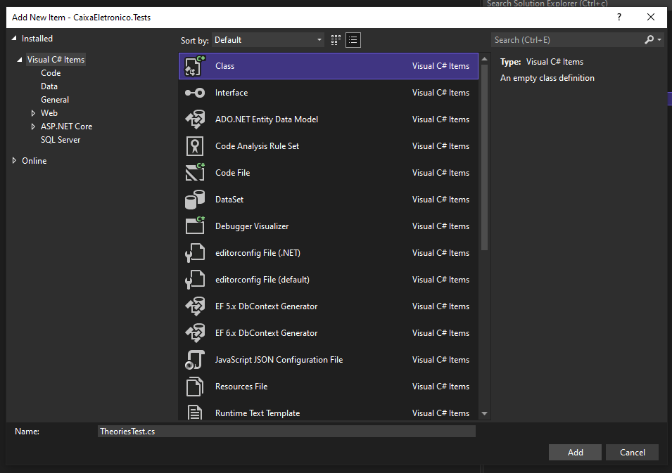

Segue o código para classe recém criada:

```csharp
using CaixaEletronico.Domain;
using Xunit;

namespace CaixaEletronico.Tests
{
    public class TheoriesTest
    {
        private readonly Caixa caixa = new Caixa();

        [Theory(DisplayName = "Saque contém número de cedulas solicitado correto")]
        [InlineData(3, 80)]
        [InlineData(3, 300)]
        [InlineData(5, 500)]
        public void Saque_Contem_Numero_De_Cedulas_Correto(int quantidadeDeCedulas, int valorDoSaque)
        {
            var resultadoCedulas = caixa.Saque(valorDoSaque);

            Assert.Equal(quantidadeDeCedulas, resultadoCedulas.Count);
        }
    }
}
```

Agora vamos executar os testes a fim de verificar se tudo está ok.

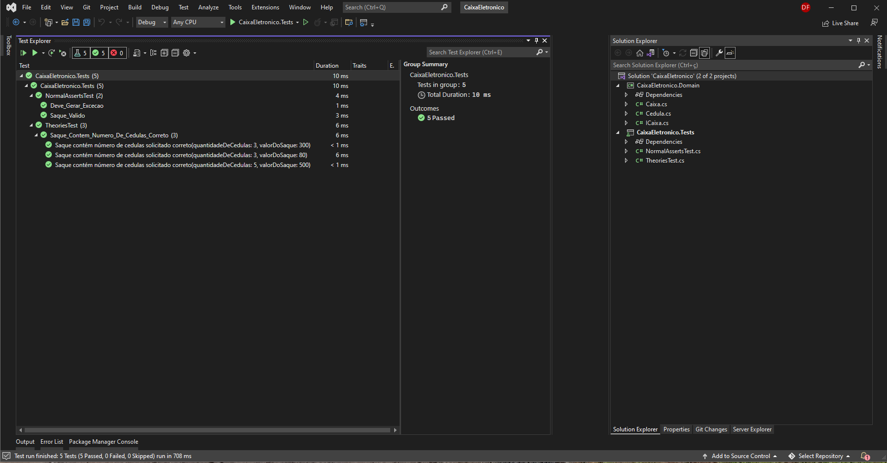

## Links e materias interessantes 

* [Melhores práticas de teste de unidade com .NET Core e .NET Standard](https://docs.microsoft.com/pt-br/dotnet/core/testing/unit-testing-best-practices)
* [C# de teste de unidade no .NET Core usando dotnet test e xUnit](https://docs.microsoft.com/pt-br/dotnet/core/testing/unit-testing-with-dotnet-test)
* [xunit.net](https://xunit.net/)
* [Exemplo de teste da xunit.net](https://xunit.net/docs/getting-started/netcore/cmdline)
