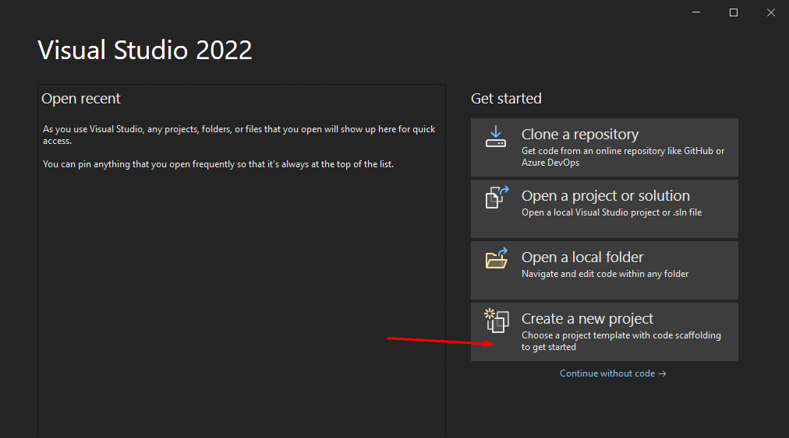

# Teste Unitário com .Net 6 com xUnit

Neste artigo vamos aprender sobre Teste Unitário e como ele pode ser implementado no .Net 6.

## O que é Teste Unitário?

Um teste de unidade é o menor pedaço de código que pode ser logicamente isolado em um sistema, geralmente pensamos no menor pedaço de código logicamente isolado como nossas funções. Com este pequeno pedaço de código, podemos executar testes automatizados que garantem que nosso código esteja sempre gerando o resultado correto.

## Por que devo testar meu código?

* Economiza tempo: em alguns casos, elimina a necessidade de testes manuais
* Automação: a capacidade de testar novamente o código alterado em tempo real
* Código Eficiente: certifique-se de que todos os cenários em potencial sejam cobertos e para tornar o Teste de Unidade possível, precisamos estruturar nosso código de maneira que possamos realmente testá-lo. O que significa que precisamos seguir certos padrões como SOLID.
* Documentação: Ajude-nos a entender a lógica por trás de nossos métodos
* Qualidade: Melhore a qualidade de nossa base de código, ajude-nos a evitar o máximo possível de dívidas tecnológicas
* Confiável: Quando os testes estão passando e sendo executados automaticamente podemos ter lançamentos mais suaves e mais frequentes

## Criando Projeto de Testes

Como projeto de exemplo, iremos criar uma aplicação simples simulando um caixa eletrônico e a disponibilização de saque de acordo com o valor solicitado e as cédulas disponíveis para saque.

Inicie o Visual Studio e clique em Create a new project



Escolha a template "Class Library"


Neste passo, iremos criar um projeto da camada de domínio, que são as regras de negócio


Escolha ".Net 6.0 (Long-term support)" que é a última versão disponível do .net até a data de criação deste tutorial


Pronto, agora temos uma estrutura básica para inciarmos o projeto


Agora vamos criar uma classe chamada "Cedula.cs" que consiste nas cédulas disponíveis


Segue o código para classe recém criada:

```csharp
namespace CaixaEletronico.Domain
{
    public static class Cedula
    {
        public static int Duzentos => 200;
        public static int Cem => 100;
        public static int Cinquenta => 50;
        public static int Vinte => 20;
        public static int Dez => 10;
        public static int Cinco => 5;
        public static int Dois => 2;
    }
}
```

Agora vamos criar uma classe do tipo interface chamada "ICaixa.cs" que consiste nas cédulas disponíveis


Segue o código para classe recém criada:

```csharp
namespace CaixaEletronico.Domain
{
    public interface ICaixa
    {
        ICollection<int> Saque(int valor);

        bool ValidaCedulasDisponiveis(int valor);
    }
}
```

Agora vamos criar uma classe chamada "Caixa.cs" que consiste nas cédulas disponíveis


Segue o código para classe recém criada:

```csharp
namespace CaixaEletronico.Domain
{
    public class Caixa : ICaixa
    {
        public ICollection<int> Saque(int valor)
        {
            var cedulasSacadas = new List<int>();
            var valorRestanteASerSacado = valor;

            while (valorRestanteASerSacado >= Cedula.Duzentos)
            {
                cedulasSacadas.Add(Cedula.Duzentos);

                valorRestanteASerSacado -= Cedula.Duzentos;
            }

            while (valorRestanteASerSacado >= Cedula.Cem)
            {
                cedulasSacadas.Add(Cedula.Cem);

                valorRestanteASerSacado -= Cedula.Cem;
            }

            while (valorRestanteASerSacado >= Cedula.Cinquenta)
            {
                cedulasSacadas.Add(Cedula.Cinquenta);

                valorRestanteASerSacado -= Cedula.Cinquenta;
            }

            while (valorRestanteASerSacado >= Cedula.Vinte)
            {
                cedulasSacadas.Add(Cedula.Vinte);

                valorRestanteASerSacado -= Cedula.Vinte;
            }

            while (valorRestanteASerSacado >= Cedula.Dez)
            {
                cedulasSacadas.Add(Cedula.Dez);

                valorRestanteASerSacado -= Cedula.Dez;
            }

            while (valorRestanteASerSacado >= Cedula.Cinco)
            {
                cedulasSacadas.Add(Cedula.Cinco);

                valorRestanteASerSacado -= Cedula.Cinco;
            }

            while (valorRestanteASerSacado >= Cedula.Dois)
            {
                cedulasSacadas.Add(Cedula.Dois);

                valorRestanteASerSacado -= Cedula.Dois;
            }

            if (cedulasSacadas.Count == 0)
                throw new System.Exception("Não há cedulas disponíveis para o valor solicitado.");

            return cedulasSacadas;
        }

        public bool ValidaCedulasDisponiveis(int valor)
        {
            return valor % 10 == 0;
        }
    }
}
```